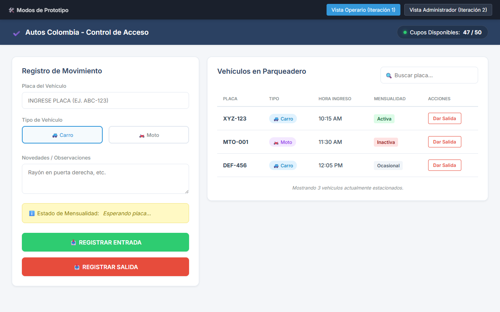
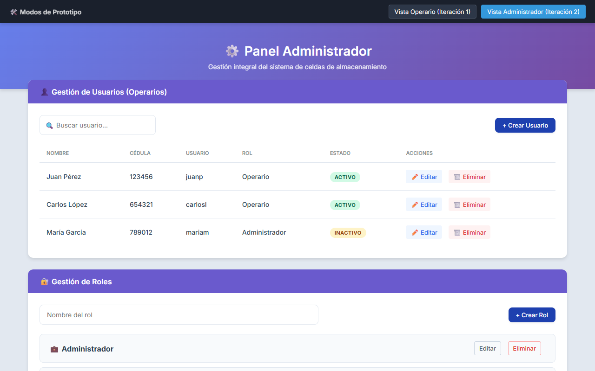

# 🚗 Autos Colombia - Sistema de Gestión de Parqueadero

Este repositorio contiene la consolidación del diseño de sistema de información y prototipado para el parqueadero "Autos Colombia", desarrollado a lo largo de las **Iteraciones 1 y 2**. El objetivo principal de la aplicación es minimizar errores operativos, agilizar el ingreso mediante un control de mensualidades y centralizar la configuración administrativa (RBAC).

## 🎯 Alcance del Proyecto

El sistema aborda dos frentes operativos clave en sus dos iteraciones iniciales:
- **Iteración 1 (Módulo Operativo):** Centrado en la **Gestión de Entrada y Salida de Vehículos**, agilizando la operación diaria para los operarios.
- **Iteración 2 (Módulo Administrativo):** Amplía la solución mediante la **Gestión de Usuarios, Roles y Celdas**, centralizando la configuración y seguridad del negocio bajo el modelo RBAC (Role-Based Access Control).

---

## 🏗️ Arquitectura del Sistema
El proyecto está diseñado bajo una arquitectura Cliente-Servidor separada en tres capas funcionales:
1. **Frontend (Capa de Presentación):** Interfaz web SPA (Single Page Application) responsiva e intuitiva, optimizada para minimizar clics y carga cognitiva (máximo 3 clics por acción). Implementada originalmente con React.
2. **Backend (Lógica de Negocio):** API REST implementada en C# .NET encargada de validaciones de mensualidades, cálculos automatizados de tiempos de permanencia y validación estructural de la base de datos.
3. **Base de Datos (Capa de Datos):** Motor relacional PostgreSQL encargado de asegurar la integridad transaccional (ACID).

---

## 📝 Requerimientos del Sistema (Funcionales y No Funcionales)

Los requerimientos del sistema fueron estructurados de manera integral para satisfacer tanto el flujo de campo (Operario) como la configuración del negocio (Administrador).

### Requerimientos Especializados - Módulo Operador (Iteración 1)
| ID | Funcionalidad | Descripción (Resumen) | Prioridad |
|----|--------------|-----------------------|-----------|
| **RF01** | Registrar entrada | Captura de placa, validación de tipo y generación de fecha/hora automática. | 5 (Crítica) |
| **RF02** | Validar mensualidad | Consulta en BD sobre el estado activo de la suscripción mensual del conductor. | 5 (Crítica) |
| **RF03** | Validar cupo | Prevención de saturación visualizando y controlando las celdas disponibles. | 5 (Crítica) |
| **RF05** | Registrar salida | Culminación del servicio y liberación de celda. | 5 (Crítica) |
| **RF06** | Calcular permanencia | Cálculo del lapso horario para la facturación a clientes ocasionales. | 5 (Crítica) |

### Requerimientos Especializados - Módulo Administrador (Iteración 2)
| ID | Funcionalidad | Descripción (Resumen) | Prioridad |
|----|--------------|-----------------------|-----------|
| **RF10-13** | CRUD Roles/Usuarios | Gestión integral de los recursos humanos, su creación, edición, borrado y listado. | Alta |
| **RF14-16** | Control de Roles | Creación de permisos jerárquicos y aislamiento lógico de las vistas de usuario. | Alta |
| **RF17-19** | Gestión de Celdas | Administración física del inventario de celdas y su estado (Libre / Ocupada). | Alta |

### Atributos de Calidad (Requerimientos No Funcionales)
1. **Rendimiento (RNF01):** Respuesta inferior a 2 segundos en validaciones de placas en base de datos.
2. **Usabilidad (RNF02):** Reducción de carga cognitiva (máximo 3 pasos para un registro completo).
3. **Disponibilidad (RNF03):** SLA del 99% de disponibilidad (24/7).
4. **Seguridad e Integridad (RNF04/05/06):** Bloqueo anti-dobles entradas, login forzado y controles rígidos del modelo RBAC.

---

## 👤 Historias de Usuario
Las funcionalidades fueron fraccionadas ágilmente bajo el modelo _"Como [Rol], quiero [Acción], para [Beneficio]"_:

**Operario:**
- `HU01.1` al `HU01.4`: Historias atadas a los flujos de *Entrada*, *Salida*, visualización del panel interactivo con el tablero de automotores estacionados y adición de novedades (daños físicos en vehículos).

**Administrador:**
- `HU02`: CRUD sobre el modelo de Operarios.
- `HU03`: Gestión y vinculación del perfil (Role Profile) hacia el colaborador.
- `HU04`: Integración del dashboard físico de celdas para su manipulación sin interferir a caja.

---

## 🎨 Diseño de Interfaz y Prototipo

El repositorio incluye un **Prototipo ejecutable `(HTML/CSS/JS)`** desarrollado para las pruebas de concepción que demuestra ambas iteraciones operativas (cambiando internamente el perfil de renderizado).

### Modo 1: Panel Operador 
(Registros operacionales rápidos y verificación en tiempo real de cupo).

### Modo 2: Panel Administrador 
(Supervisión del Back-office integrando celdas, estadísticas de flujo, sistema de roles).

> **Prototipo Funcional:** Para probar la interactividad del MOCKUP Front-End, simplemente abre el archivo `/prototipo/index.html` en cualquier navegador web.

---

## 🧪 Plan de Pruebas (Validación de Calidad)

El software cuenta con un esquema de 30 Casos de Prueba (CP) divididos por módulos, entre los que destacan:

1. **Pruebas de Entrada/Salida (`CP01` - `CP09`):** Simulando ingresos con parqueadero lleno (Bloqueo exitoso), cálculos transaccionales correctos y protección contra vehículos "duplicados".
2. **Pruebas de Usuarios y Roles (`CP10` - `CP19`):** Comprobación de que perfiles `Operario` carecen de visibilidad y acceso a URLs restringidas de `Admin`.
3. **Pruebas de Celdas (`CP20` - `CP24`):** Alteración manual e inyección de datos para comprobar estados *Ocupados* o *Disponibles*.

---

## 📂 Organización del Repositorio
- `/database`: Scripts de implementación física de la base de datos PostgreSQL (`Script base de datos.sql`).
- `/docs`: Documentación original entregable (`.docx`) y anexos visuales del software.
- `/prototipo`: Software Front-End estático para visualización directa y validación del modelo de requerimientos.

_Elaborado por:_
***Yonier Alexis Quiceno Rodríguez** y **Jonathan Alvarez Bustamante*** - IU Digital de Antioquia (2026).
